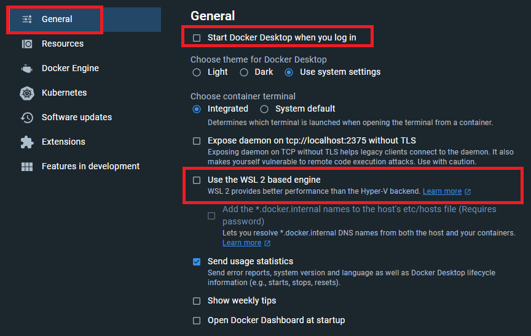
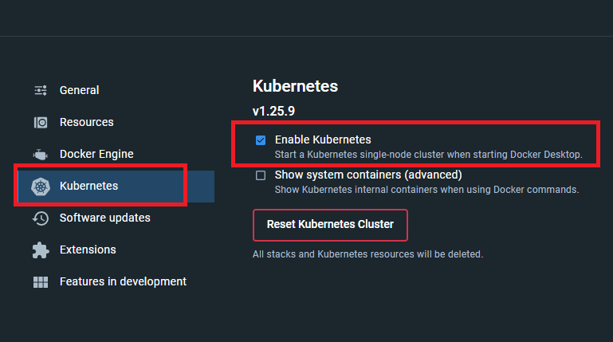
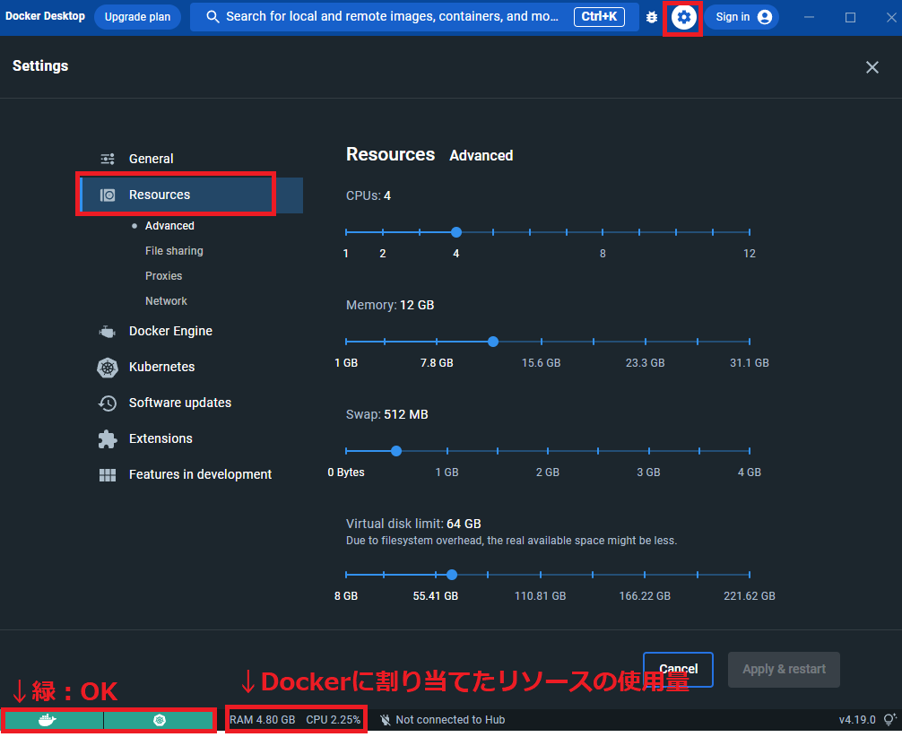
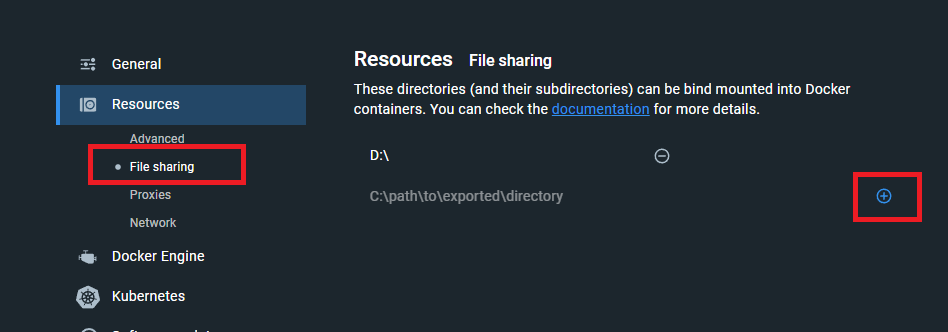
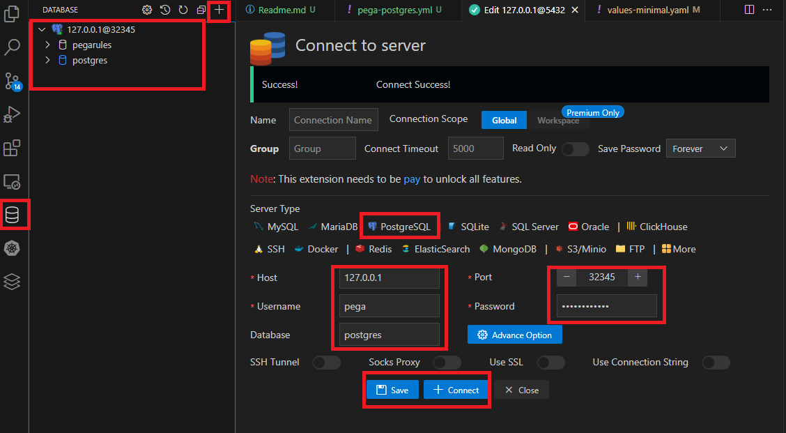

# 概要

k8sベースのPega Systemsの動作環境(`Pega + PostgreSQL`)を構築するためのリポジトリです。<br/>
ローカルでさくっと起動するための構成になっています。<br/>
当リポジトリに記載されているユーザ名やパスワード、各種設定は<b>サンプル用</b>として利用してください。<br/>
<span style="color:red;">本番運用では絶対利用しないこと！</span><br/>

k8sの操作をしやすくする(入力補完、エイリアス)ためにリモートコンテナを利用していますが、不要な方は該当手順をスキップし、各種`k`コマンドを`kubectl`に置き換えて実行してください。


# 動作環境

- Kubernetes･･･1.25.9
- kubectl･･･1.25.9
- helm･･･3.11.3
- 各種pegaコンテナイメージ･･･8.8.2


# ファイル構成

当リポジトリの`pega/charts/pega`は[公式のpega/charts/pega](https://github.com/pegasystems/pega-helm-charts/tree/master/charts/pega)（`https://github.com/pegasystems/pega-helm-charts/commit/2b5e96c3842a5f8290c43cdd1de31a8f1e75f772`）から取得したものです。<br/>

```
pega/charts/pega/               ･･･Pega公式のHelm Chart
           values-minimal.yaml  ･･･Pega用Helm変数ファイル(pega/charts/pega/values-minimal.yaml)
           pega-postgres.yml    ･･･PostgreSQL用のマニフェスト
```

# 事前準備

## Docker Desktop

1. Docker Desktopをインストールする
1. 非WSL2モードに設定（作者都合）<br/>
    
1. Kubernetesを有効化<br/>
    
1. 各種リソース条件を設定し、「Apply＆ restart」後に左下がすべて「緑」になるまで待機<br/>
    最低限：CPU>=4、メモリ>=12GB<br/>
    
1. 当ソースがあるフォルダを共有に追加<br/>
    例：`c:\k8s-pega-sample`にある場合は、`c:\k8s-pega-sample`を追加します<br/>
    


## VSCode

1. [VSCode](https://code.visualstudio.com/download)をインストールする
1. 拡張機能で[Remote Development](https://marketplace.visualstudio.com/items?itemName=ms-vscode-remote.vscode-remote-extensionpack)を追加する

# 手順

## リモートコンテナを起動する

1. Docker Desktopを起動する
1. Docker Desktopのk8sの`config`(`%USERPROFILE%\.kube\config`)をkube-configにコピー<br/>
    複数のコンテキストがある場合、デフォルトを`docker-desktop`になるように編集してください
1. VSCode「Remote Container」を起動する<br/>
    初回時間がかかります<br/>
    <br/>
    左のエクスプローラーが表示されたら起動完了<br/>
1. 「Ctrl」+「@」でターミナルを開く<br/>
    以降の手順はこのターミナルで実行していきます<br/>
1. 以下のコマンドを実行し、以下のような結果が返ってくればOK<br/>
    `k`はkubectlのエイリアス<br/>
    トラブルを避けるためにクライアントとサーバのバージョンは揃えておくと良い<br/>
    詳しくは[こちら](https://kubernetes.io/ja/docs/setup/release/version-skew-policy/)を参照<br/>
    ```shell
    > k version

    WARNING: This version information is deprecated and will be replaced with the output from kubectl version --short.  Use --output=yaml|json to get the full version.
    Client Version: version.Info{Major:"1", Minor:"25", GitVersion:"v1.25.9", GitCommit:"a1a87a0a2bcd605820920c6b0e618a8ab7d117d4", GitTreeState:"clean", BuildDate:"2023-04-12T12:16:51Z", GoVersion:"go1.19.8", Compiler:"gc", Platform:"linux/amd64"}
    Kustomize Version: v4.5.7
    Server Version: version.Info{Major:"1", Minor:"25", GitVersion:"v1.25.9", GitCommit:"a1a87a0a2bcd605820920c6b0e618a8ab7d117d4", GitTreeState:"clean", BuildDate:"2023-04-12T12:08:36Z", GoVersion:"go1.19.8", Compiler:"gc", Platform:"linux/amd64"}
    ```

## Pega

以下のコマンドはすべて`pega/charts/`配下で実行します。

### 1. namespace作成（オプション）

当手順はオプションになります。<br/>
なお、以下の手順でリソースを当namespaceにデプロイした場合は、各コマンドでnamespaceを指定する必要があります。<br/>
ローカル環境であれば不要でよい。

```shell
k create namespace mypega
```

### 2. PostgreSQLのデプロイ

Runningになるまで確認すること

```shell
k apply -f pega-postgres.yml
```

### 3. 各種Dockerコンテナイメージをpullする

installer、pega、searchは**バージョンを揃える**こと<br/>
installerは約7GBあるので、pull完了するまでにかなり時間がかかります。<br/>
複数人で共有する場合は、ローカルネットワーク内にコンテナイメージレジストリ([Harbor](https://goharbor.io/))を設けて2人目以降はそこからpullすることをお勧めします。<br/>
なお、ローカルのコンテナレジストリを設けた場合は、後続の手順や各種変数において該当箇所を適宜修正してください。<br/>

下記のPega用dockerレジストリのユーザ名、PWは[公式ドキュメント](https://docs.pega.com/bundle/platform-88/page/platform/deployment/client-managed-cloud/pega-docker-images-manage.html#cmc-docker-images-overview)を参考に発行してください。

```shell
# Pegaのプライベートリポジトリを参照できるようにログインする
# successと表示されればOK
docker login pega-docker.downloads.pega.com -u <ユーザ名> -p <キー>

docker pull pega-docker.downloads.pega.com/platform/installer:8.8.2
docker pull pega-docker.downloads.pega.com/platform/pega:8.8.2
docker pull pega-docker.downloads.pega.com/platform/search:8.8.2
docker pull pega-docker.downloads.pega.com/platform/clustering-service:1.3.4
docker pull pega-docker.downloads.pega.com/platform/clustering-service-kubectl:1.0.0

```

#### 【番外編】使用可能のコンテナイメージ一覧を取得

詳しくは上記の公式ドキュメント

```shell
curl -X GET https://pega-docker.downloads.pega.com/v2/_catalog -H "X-JFrog-Art-Api:<キー>"
```

#### 【番外編】特定のコンテナイメージの使用可能のタグ一覧を取得

詳しくは上記の公式ドキュメント

```shell
curl -X GET "https://pega-docker.downloads.pega.com/v2/<コンテナイメージ名>/tags/list" -H "X-JFrog-Art-Api:<キー>"
```

### 4. values-minimal.yamlを編集

`pega/charts/pega/values-minimal.yaml`をベースに前述の最小リソース量で起動できるように修正したもの<br/>
また、最小構成になるように`replicas`はすべて1にしています。<br/>
詳しい変更内容は初回コミットとの差分で比較してください。

- `actions.execute: "install"`
- `jdbc.url`･･･`jdbc:postgresql://pega-postgres.<namespace>.svc.cluster.local:5432/pegarules`<br/>
    `<namespace>`･･･postgresqlデプロイ時のnamespaceに設定すること。namespace未指定の場合は`default`になります。
- `jdbc.username`と`jdbc.password`は`pega-postgres.yml`の`POSTGRES_USER`と`POSTGRES_PASSWORD`になります。(初期値から変更していなければそのままでOK)
- `docker.registry.username`と`docker.registry.password`にdocker login情報

### 5. Pega初期データの投入

```shell
# 初回のみ
helm dependency build pega

# completedになるまで10分以上かかります
# 進行状況を確認する場合は、logsコマンドで処理を確認しましょう
helm install -f values-minimal.yaml pega-install ./pega

# 完了すると以下のようになります
NAME                    READY   STATUS      RESTARTS   AGE
pega-db-install-d6dld   0/1     Completed   0          11m
```

### 6. Pega起動

values-minimal.yamlの`actions.execute: "deploy"`に編集し、以下を実行<br/>
`pega-web-0`でポートが競合エラーになっている場合は、`service.NodePort`を変更してください。

```shell
helm install -f values-minimal.yaml pega-deploy ./pega

# db-installを除くPodがすべて1/1になったら起動完了
NAME                    READY   STATUS      RESTARTS      AGE
pega-db-install-d6dld   0/1     Completed   0             17h
pega-hazelcast-0        1/1     Running     0             16m
pega-postgres-0         1/1     Running     4 (43m ago)   17h
pega-search-0           1/1     Running     0             16m
pega-web-0              1/1     Running     0             16m
```

### 7. 動作確認

ブラウザで`http://localhost:30000/prweb`にアクセスすると見慣れたPegaのログイン画面が表示されるかと思います。<br/>
※`service.NodePort`を変更した場合はそのポート番号にしてください。

- ユーザ名: `Administrator@pega.com`
- pw: values-minimal.yamlの`installer.adminPassword`

# 片付け

```shell

# pegaインストーラの削除（初回実行後にいつでも削除可）
helm uninstall pega-install

# pegaアプリケーションの削除
helm uninstall pega-deploy

# DBの削除（データは残る）
k delete -f pega-postgres.yml
```

# 番外編

## DBのデータを削除

`pega-postgres.yml`の`initContainers`配下のコメントアウトを解除し、applyする

```shell
k apply -f pega-postgres.yml
```

PostgresのPodが再作成されたら、再度コメントアウトし、applyする

```shell
k apply -f pega-postgres.yml
```

## DB接続

リモートコンテナを利用されている場合は、拡張機能「Database」から直接データを参照することができます<br/>
- ホストは`127.0.0.1`
- ユーザ名、PW、Database名はそれぞれ`POSTGRES_USER`、`POSTGRES_PASSWORD`、`POSTGRES_DB`
- ポート番号は`pega-postgres.yml`の`nodePort`で指定したもの

<br/>


## Podのlogを確認する

Podの実行ログの確認

```shell
k logs pod名

# ログを追従する
k logs pod名 -f
```

## Podの状態を確認する

正常にPodが起動されていない時の状態確認

```shell
k describe po pod名
```